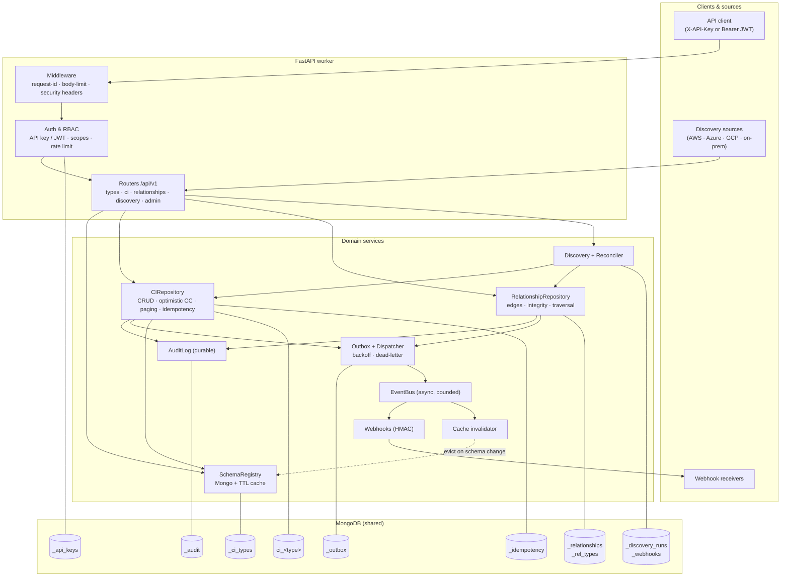
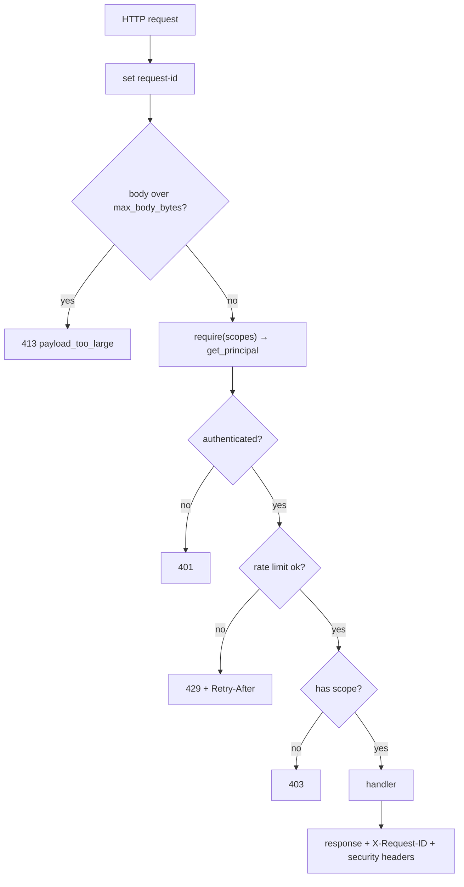
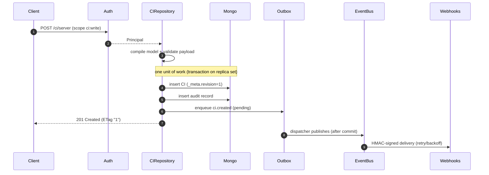
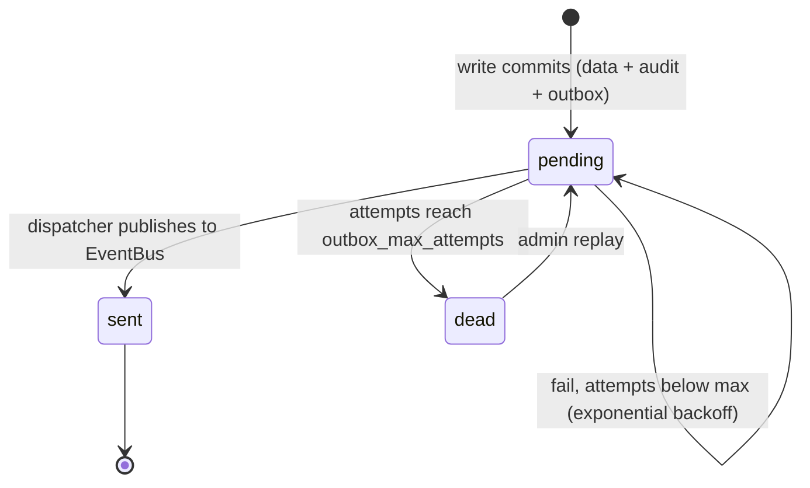
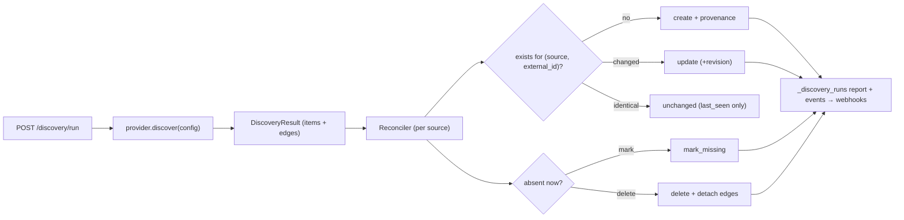
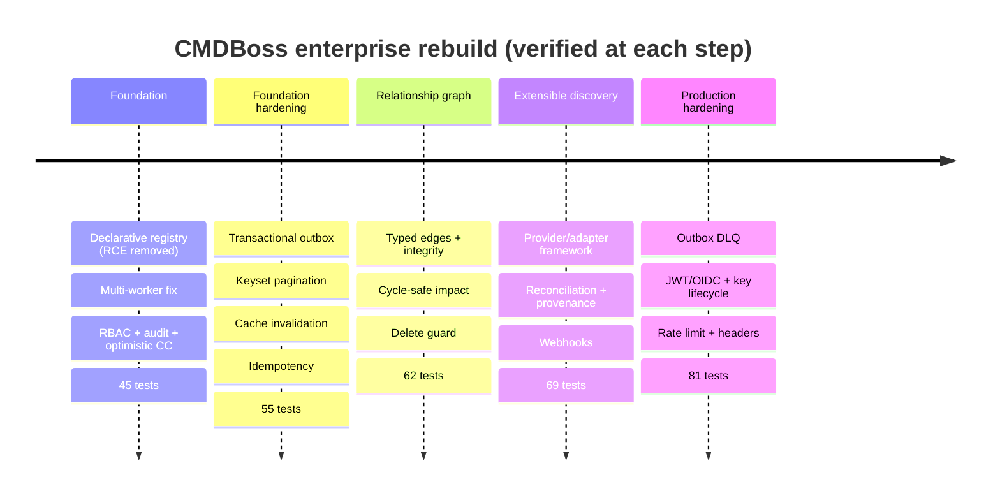

<div align="center">

```
 ██████╗███╗   ███╗██████╗ ██████╗  ██████╗ ███████╗███████╗
██╔════╝████╗ ████║██╔══██╗██╔══██╗██╔═══██╗██╔════╝██╔════╝
██║     ██╔████╔██║██║  ██║██████╔╝██║   ██║███████╗███████╗
██║     ██║╚██╔╝██║██║  ██║██╔══██╗██║   ██║╚════██║╚════██║
╚██████╗██║ ╚═╝ ██║██████╔╝██████╔╝╚██████╔╝███████║███████║
 ╚═════╝╚═╝     ╚═╝╚═════╝ ╚═════╝  ╚═════╝ ╚══════╝╚══════╝
```

### **Declarative, API-driven Configuration Management Database**
*Schema-as-data · Strict validation · RBAC · Optimistic concurrency · Durable audit · Event-driven*


</div>

---

## What is CMDBoss?

**CMDBoss** is a lightweight Configuration Management Database (CMDB) backbone. You
define Configuration Item (CI) types **as data** and immediately get a strict,
authenticated, audited CRUD API for them — with no code uploads and no per-model
boilerplate.

- Define CI types with a **declarative schema DSL** (types, constraints, enums, arrays, references, indexes).
- Get a **generic, validated CRUD surface** for every type instantly.
- **RBAC** via scoped API keys on every route.
- **Optimistic concurrency** (HTTP `ETag` / `If-Match`) to prevent lost updates.
- **Durable change-audit** with field-level lineage on every mutation.
- A **non-blocking event bus** for downstream side-effects (notifications, discovery triggers).

> **Security note:** earlier versions executed uploaded Python to define models — an
> unauthenticated remote-code-execution path that was also incompatible with a
> multi-worker deployment. That mechanism has been removed. See
> [ADR-0001](docs/adr/0001-declarative-schema-registry.md).

---

## Architecture

Each Gunicorn worker is a self-contained FastAPI app; **all shared state lives in
MongoDB**, so workers never diverge. The API layer is thin (middleware + auth +
routers) and each domain service owns one concern and one set of collections.



> **Full diagram set** — request lifecycle, CI write path, auth flow, outbox
> dead-letter queue, graph impact analysis, discovery pipeline, data model and
> deployment topology — is in **[docs/ARCHITECTURE.md](docs/ARCHITECTURE.md)**.

---

## Quick Start

### With Docker

```bash
# Set a strong bootstrap admin key first (used only if no keys exist yet)
export CMDBOSS_BOOTSTRAP_ADMIN_KEY="$(openssl rand -hex 24)"
docker compose up --build
```

| Interface  | URL                              |
|------------|----------------------------------|
| Swagger UI | `http://localhost:8000/docs`     |
| API root   | `http://localhost:8000/`         |
| Health     | `http://localhost:8000/api/v1/healthz` / `…/readyz` |

### Local (dev)

```bash
python -m venv venv && source venv/bin/activate
pip install -r requirements.txt -r requirements-dev.txt
cp .env.example .env            # then edit secrets
python -m cmdboss.main          # set CMDBOSS_RELOAD=true for autoreload
```

---

## Authentication & RBAC

All `/api/v1/*` routes require an `X-API-Key`. On first startup, if no keys exist
and `CMDBOSS_BOOTSTRAP_ADMIN_KEY` is set, that value is registered as an **admin**
key. Use it to mint scoped keys, then rotate it.

| Scope          | Grants                              |
|----------------|-------------------------------------|
| `types:read`   | read CI type definitions            |
| `types:write`  | create / update / deactivate types  |
| `ci:read`      | read CIs, list, audit history       |
| `ci:write`     | create / update / delete CIs        |
| `admin`        | superscope — implies all + key mgmt |

Role presets when minting keys: `reader`, `writer`, `admin`.

```bash
# Mint a writer key (admin only); the raw key is shown exactly once
curl -X POST http://localhost:8000/api/v1/admin/api-keys \
  -H "X-API-Key: $CMDBOSS_BOOTSTRAP_ADMIN_KEY" \
  -H "Content-Type: application/json" \
  -d '{"name": "ci-bot", "role": "writer"}'
```

---

## Defining CI types (declarative)

Types are **data**, not code. Field types: `string`, `integer`, `number`,
`boolean`, `datetime`, `array`, `object`, `reference`. Constraints: `required`,
`enum`, `min_length`/`max_length`, `pattern`, `minimum`/`maximum`,
`min_items`/`max_items`.

```bash
curl -X POST http://localhost:8000/api/v1/types \
  -H "X-API-Key: $KEY" -H "Content-Type: application/json" \
  --data @examples/server_type.json
```

See [`examples/server_type.json`](examples/server_type.json) and
[`examples/README.md`](examples/README.md) for a full walkthrough.

---

## Working with Configuration Items

```bash
# Create — returns 201 with an ETag carrying the revision
curl -X POST http://localhost:8000/api/v1/ci/server \
  -H "X-API-Key: $KEY" -H "Content-Type: application/json" \
  -d '{"hostname":"web-01","ip_address":"10.0.1.10","os":"Ubuntu 22.04","environment":"production"}'

# List with pagination + equality filters
curl "http://localhost:8000/api/v1/ci/server?environment=production&limit=25&include_total=true" \
  -H "X-API-Key: $KEY"

# Update with optimistic concurrency — If-Match must equal the current revision
curl -X PATCH http://localhost:8000/api/v1/ci/server/$ID \
  -H "X-API-Key: $KEY" -H 'If-Match: "1"' -H "Content-Type: application/json" \
  -d '{"notes":"patch window scheduled"}'   # 409 if another writer moved the revision

# Per-asset change history / lineage
curl http://localhost:8000/api/v1/ci/server/$ID/audit -H "X-API-Key: $KEY"
```

### Endpoint reference

| Method & path                                   | Scope         | Notes                            |
|-------------------------------------------------|---------------|----------------------------------|
| `POST /api/v1/types`                            | `types:write` | define a CI type                 |
| `GET /api/v1/types` · `GET /api/v1/types/{n}`   | `types:read`  | list / fetch (+ JSON Schema)     |
| `PUT /api/v1/types/{n}`                         | `types:write` | replace schema (version bump)    |
| `DELETE /api/v1/types/{n}`                      | `types:write` | soft-delete (name reserved)      |
| `POST /api/v1/ci/{type}`                        | `ci:write`    | create CI                        |
| `GET /api/v1/ci/{type}`                         | `ci:read`     | paginated, filterable list       |
| `GET /api/v1/ci/{type}/{id}`                    | `ci:read`     | fetch one (ETag)                 |
| `PUT`/`PATCH /api/v1/ci/{type}/{id}`            | `ci:write`    | requires `If-Match`              |
| `DELETE /api/v1/ci/{type}/{id}`                 | `ci:write`    | optional `If-Match`              |
| `GET /api/v1/ci/{type}/{id}/audit`              | `ci:read`     | change history                   |
| `POST`/`GET /api/v1/admin/api-keys`             | `admin`       | key management                   |
| `GET /api/v1/healthz` · `readyz` · `metrics`    | public        | probes / Prometheus              |

---

## Relationships & dependency graph

CIs connect through **typed, directed edges** governed by declarative
relationship-type contracts (`from_types`/`to_types`, cardinality, a `dependency`
flag). Edge writes enforce referential integrity, cardinality, uniqueness, and —
for dependency edges — acyclicity. See [ADR-0002](docs/adr/0002-ci-relationship-graph.md).

```bash
# Define a relationship type (types:write)
curl -X POST http://localhost:8000/api/v1/relationship-types \
  -H "X-API-Key: $KEY" -H "Content-Type: application/json" \
  -d '{"name":"depends_on","from_types":["server"],"to_types":["server"],"dependency":true}'

# Create an edge (ci:write)
curl -X POST http://localhost:8000/api/v1/relationships \
  -H "X-API-Key: $KEY" -H "Content-Type: application/json" \
  -d '{"rel_type":"depends_on","from":{"type":"server","id":"<A>"},"to":{"type":"server","id":"<B>"}}'

# Impact / blast radius: what depends on B (transitively)?
curl http://localhost:8000/api/v1/ci/server/<B>/impact -H "X-API-Key: $KEY"
# Dependencies: what does A depend on (transitively)?
curl http://localhost:8000/api/v1/ci/server/<A>/dependencies -H "X-API-Key: $KEY"
```

| Method & path | Scope | Notes |
|---|---|---|
| `POST/GET/DELETE /api/v1/relationship-types[/{name}]` | `types:*` | edge-type contracts |
| `POST/GET/DELETE /api/v1/relationships[/{id}]` | `ci:*` | typed edges (integrity enforced) |
| `GET /api/v1/ci/{type}/{id}/relationships` | `ci:read` | direct neighbors (`?direction=in\|out\|both`) |
| `GET /api/v1/ci/{type}/{id}/dependencies` | `ci:read` | transitive dependencies |
| `GET /api/v1/ci/{type}/{id}/impact` | `ci:read` | blast radius |

Deleting a CI that has relationships is blocked (`409`) unless you pass
`?detach=true`, which removes its edges atomically.

---

## Discovery & integration

CMDBoss populates itself from external sources through a provider/adapter
framework. A provider returns a normalized snapshot; a source-scoped reconciler
diffs it against the CMDB and converges them through the validated write paths,
tagging provenance (`_meta.source`, `external_id`, `discovery_run_id`,
`last_seen`) so manual and discovered data coexist. Adding AWS/Azure/GCP is one
adapter class. See [ADR-0003](docs/adr/0003-extensible-discovery.md).

```bash
# Run discovery (the built-in 'static' provider ingests a snapshot you supply)
curl -X POST http://localhost:8000/api/v1/discovery/run \
  -H "X-API-Key: $KEY" -H "Content-Type: application/json" \
  -d '{"provider":"static","source":"aws","on_missing":"mark","config":{
        "items":[{"type":"server","external_id":"i-1","data":{"hostname":"web-1","environment":"production"}}],
        "relationships":[]}}'
# -> { run_id, report: { ci:{created,updated,unchanged,deleted,marked_missing,errors}, relationships:{...} } }

curl http://localhost:8000/api/v1/discovery/runs -H "X-API-Key: $KEY"

# Outbound webhooks: HMAC-signed event delivery (admin)
curl -X POST http://localhost:8000/api/v1/webhooks \
  -H "X-API-Key: $KEY" -H "Content-Type: application/json" \
  -d '{"url":"https://example.com/hook","event_types":["ci.created","ci.updated"],"secret":"shhh"}'
```

| Method & path | Scope | Notes |
|---|---|---|
| `POST /api/v1/discovery/run` | `ci:write` | run a provider + reconcile (`on_missing`: mark\|delete) |
| `GET /api/v1/discovery/providers` | `ci:read` | registered adapters |
| `GET /api/v1/discovery/runs[/{id}]` | `ci:read` | run history + reports |
| `POST/GET /api/v1/webhooks` | `admin` | register / list outbound webhooks |

Re-running discovery over an unchanged inventory is cheap — unchanged items only
refresh `last_seen` (no revision bump, no event).

---

## Configuration

All settings are environment variables prefixed `CMDBOSS_` (overriding the legacy
`config.json`). See [`.env.example`](.env.example) for the full list — key ones:
`CMDBOSS_MONGO_URI`, `CMDBOSS_AUTH_ENABLED`, `CMDBOSS_BOOTSTRAP_ADMIN_KEY`,
`CMDBOSS_CORS_ORIGINS`, `CMDBOSS_SCHEMA_CACHE_TTL_SECONDS`, `CMDBOSS_MAX_PAGE_SIZE`.

---

## Testing

The suite runs fully in-process against an async MongoDB mock — **no live database
required**:

```bash
pip install -r requirements.txt -r requirements-dev.txt
ruff check .
pytest --cov=cmdboss
```

Coverage spans the schema compiler, registry persistence/caching, CRUD,
RBAC enforcement, optimistic-concurrency conflicts, pagination and validation.

---

## Engineering log — results of every milestone

The codebase was rebuilt in five verified milestones. Each one was kept green
(all tests passing + `ruff` clean) before the next began.

| # | Milestone | Key deliverables | Directives | Verified |
|---|-----------|------------------|-----------|----------|
| 1 | **Foundation** | Declarative schema registry (RCE removed), multi-worker fix, API-key RBAC, durable audit, optimistic concurrency, Docker/CI | #1 #4 | **45 tests**, ruff clean |
| 2 | **Foundation hardening** | Transactional outbox, keyset pagination, cross-worker cache invalidation, idempotency keys | #2 #4 | **55 tests**, ruff clean |
| 3 | **Relationship graph** | Typed-edge contracts + integrity, cardinality, cycle safety, impact/blast-radius traversal, CI delete guard | #1 | **62 tests**, ruff clean |
| 4 | **Extensible discovery** | Provider/adapter framework, source-scoped reconciliation with provenance, outbound webhooks | #3 | **69 tests**, ruff clean |
| 5 | **Production hardening** | Outbox dead-letter queue + replay, JWT/OIDC + API-key lifecycle, rate limiting, body cap, security headers | #4 | **81 tests**, ruff clean |

Decisions are recorded in [ADR-0001](docs/adr/0001-declarative-schema-registry.md) ·
[0002](docs/adr/0002-ci-relationship-graph.md) ·
[0003](docs/adr/0003-extensible-discovery.md) ·
[0004](docs/adr/0004-production-hardening.md).

**Current verified state:**

```text
$ ruff check .
All checks passed!

$ pytest --cov=cmdboss -q
81 passed
TOTAL        2428    305    87%

$ python -c "from cmdboss.app import create_app; print(len(create_app().openapi()['paths']))"
26          # OpenAPI 3.1 paths exposed
```

---

## Workflows & pipelines

### Request lifecycle (every request)



### CI write path — atomic CRUD + audit + outbox (the core workflow)



### Event delivery & dead-letter pipeline



### Discovery & reconciliation pipeline



### Build evolution



> The complete diagram set (component map, auth flow, graph integrity, data model,
> deployment topology) lives in **[docs/ARCHITECTURE.md](docs/ARCHITECTURE.md)**.

---

## Pushing to GitHub

Publish everything to [`TagoreNand/cmdboss`](https://github.com/TagoreNand/cmdboss.git).
Run these from the project folder:

```bash
cd cmdboss-main                     # your local project folder

# 1) initialise git (skip if this folder is already a clone)
git init
git branch -M main

# 2) point origin at the repo (add, or update if it already exists)
git remote add origin https://github.com/TagoreNand/cmdboss.git \
  || git remote set-url origin https://github.com/TagoreNand/cmdboss.git

# 3) stage + commit everything
git add -A
git commit -m "feat: enterprise CMDBoss — declarative registry, dependency graph, discovery, production hardening"

# 4) publish — the remote holds the old baseline, so replace it
git push -u origin main --force
```

For a **milestone-by-milestone history** (one commit per build step) instead of a
single commit, run the provided script:

```bash
bash scripts/git_push.sh            # creates 6 narrative commits, then force-pushes
```

> `--force` overwrites the previous `main` (the original `exec`-based baseline).
> Drop `--force` and `git pull --rebase` first if you want to preserve that history.

---

## Project structure

```
cmdboss/
├── app.py            # FastAPI factory, lifespan, middleware, router mounting
├── config.py         # env-first Settings (config.json fallback)
├── observability.py  # JSON logging, request-id, metrics facade
├── errors.py         # structured error envelope + handlers
├── db.py             # Mongo client lifecycle, indexes, transaction() helper
├── schema.py         # declarative DSL + Pydantic compiler (no exec)
├── registry.py       # Mongo-backed schema registry + per-worker cache
├── repository.py     # generic CI CRUD, optimistic CC, pagination, discovery upsert
├── cursor.py         # opaque keyset pagination tokens
├── idempotency.py    # Idempotency-Key store (safe create retries)
├── invalidator.py    # cross-worker schema-cache invalidation
├── audit.py          # durable change-audit / lineage
├── events.py         # bounded, non-blocking async event bus
├── outbox.py         # transactional outbox + dispatcher + dead-letter queue
├── webhooks.py       # HMAC-signed outbound webhook delivery
├── ratelimit.py      # per-principal fixed-window rate limiter
├── security.py       # API-key + JWT/OIDC auth, RBAC scopes, key lifecycle
├── graph.py          # relationship registry + edge repository + BFS traversal
├── graph_schema.py   # declarative relationship-type contracts
├── deps.py           # dependency accessors
├── main.py           # local/dev entrypoint
├── discovery/        # provider/adapter framework + reconciler + run service
└── routers/          # types · ci · graph · discovery · system
docs/adr/             # architecture decision records (0001–0004)
docs/ARCHITECTURE.md  # full Mermaid diagram set + analysis
examples/             # declarative type example (+ legacy assets)
tests/                # pytest suite — 81 tests, mongomock-motor (no live DB)
```

---

## Roadmap

- [x] Authentication & RBAC (scoped API keys)
- [x] Declarative schema registry (replaces code upload; multi-worker safe)
- [x] Audit log with change history / lineage
- [x] Optimistic concurrency, pagination, structured errors, metrics hooks
- [x] Transactional outbox, keyset pagination, cross-worker cache invalidation, idempotency keys
- [x] CI **relationship / dependency graph** (typed edges, integrity, cycle-safe impact analysis)
- [x] **Extensible discovery**: provider/adapter framework + source-scoped reconciliation with provenance
- [x] Outbound webhooks (HMAC-signed, downstream of the durable outbox)
- [x] Production hardening: outbox dead-letter queue, JWT/OIDC auth, API-key lifecycle, rate limiting, body-size + security headers
- [ ] First-party AWS / Azure / GCP adapters + MCP-tool provider
- [ ] Background/scheduled discovery runs; durable webhook delivery queue
- [ ] Web UI dashboard

---

## License

MIT — see [LICENSE](LICENSE).
