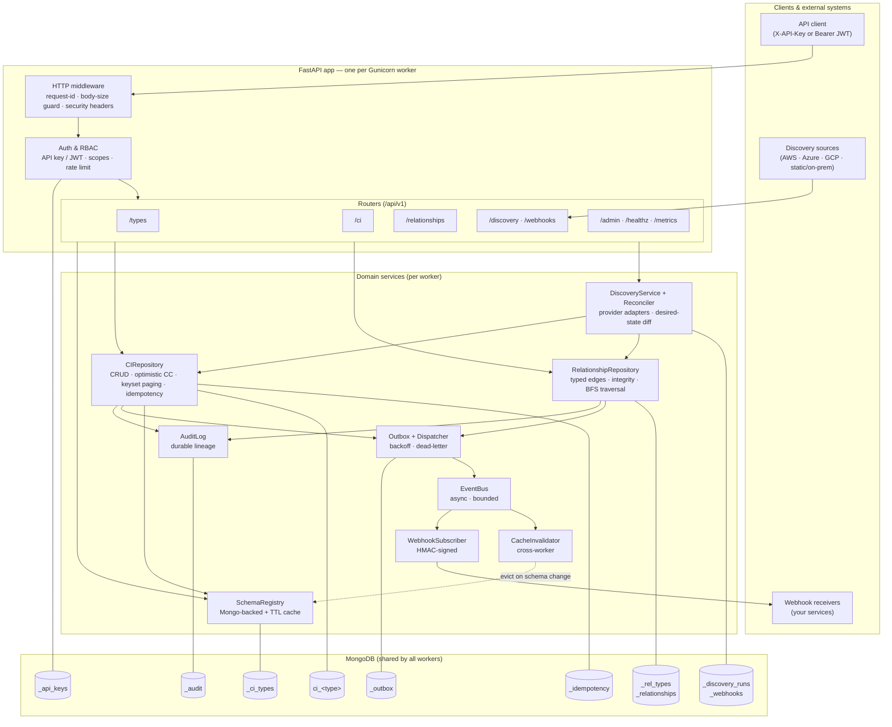
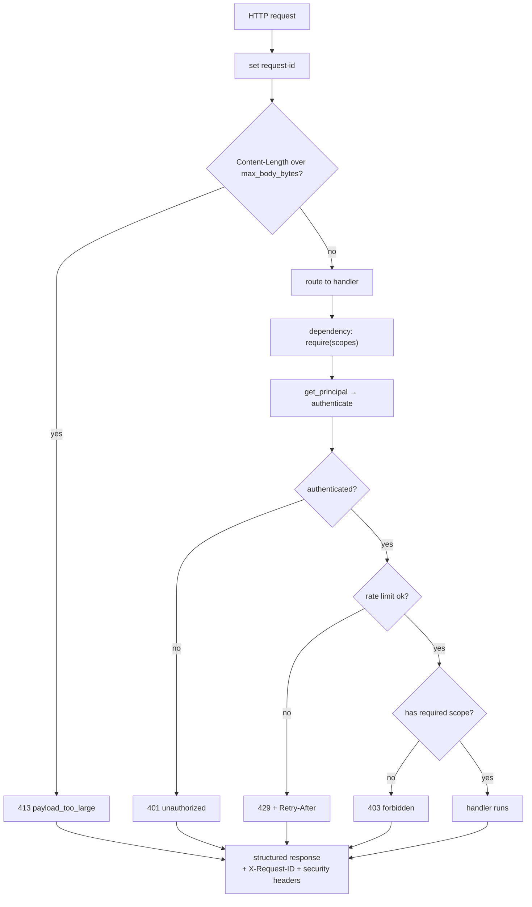
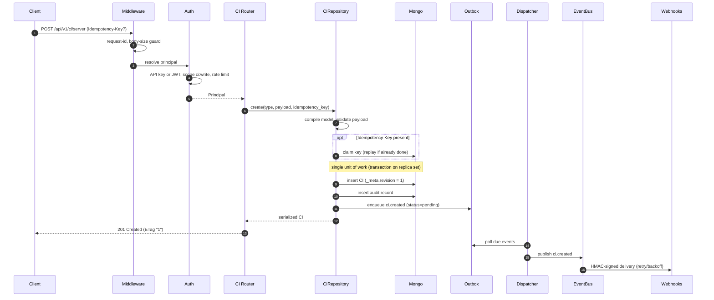
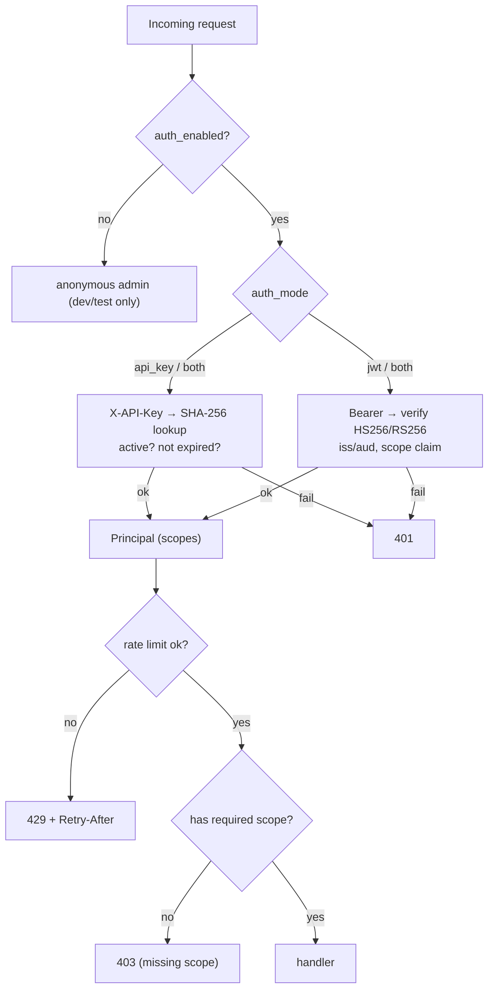
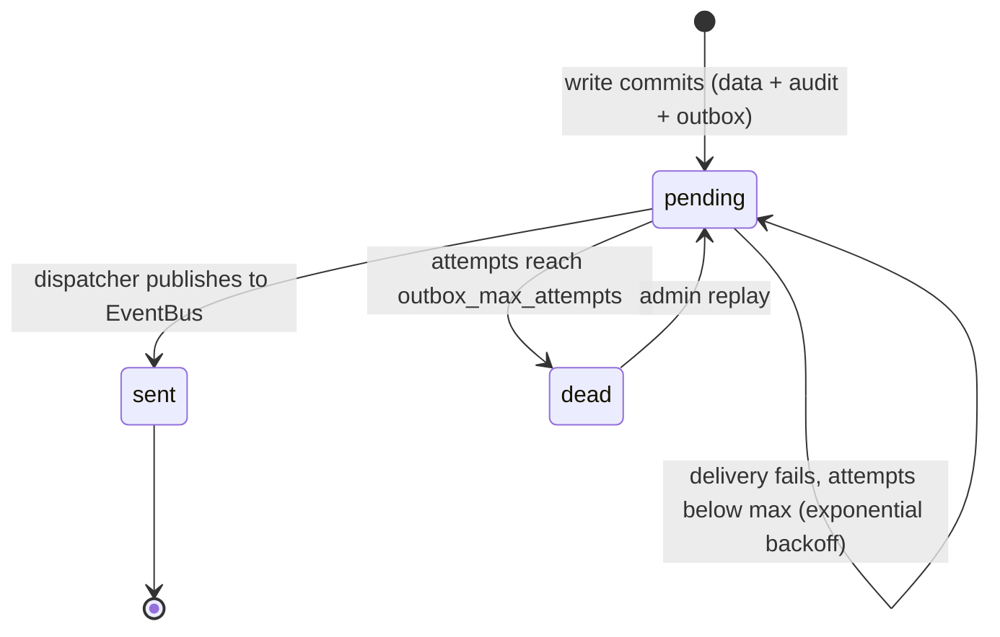
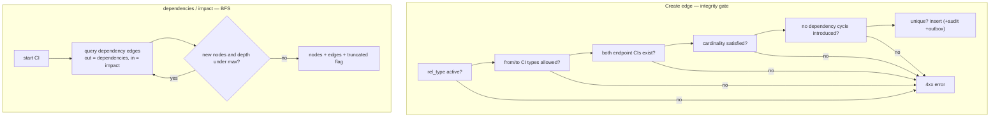
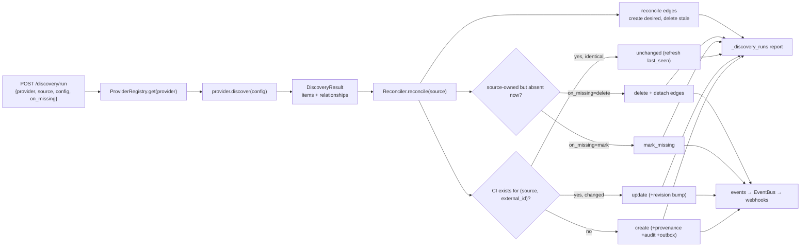
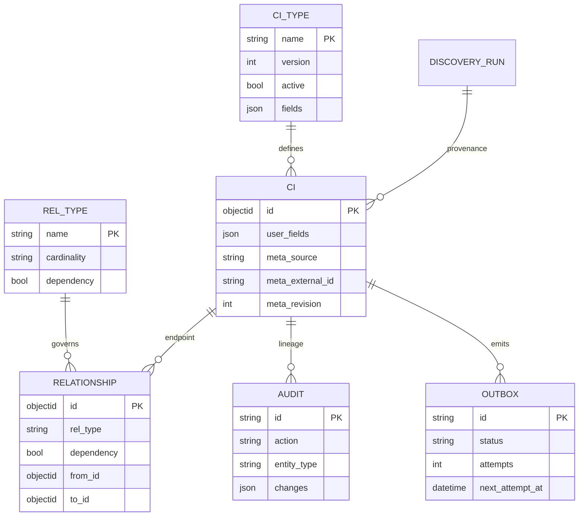
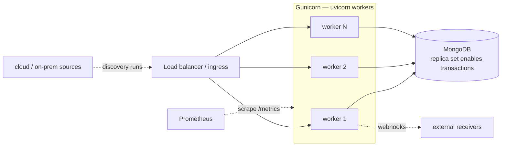
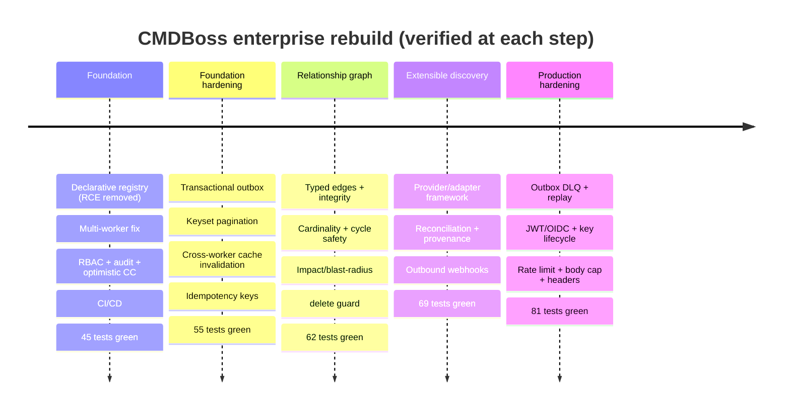

# CMDBoss — Architecture, Workflows & Pipelines

This document is the detailed, diagram-driven view of CMDBoss after the
enterprise rebuild. Every diagram below is rendered natively by GitHub
(Mermaid). For the *why* behind each major decision, see the
[ADRs](adr/).

- [1. System architecture](#1-system-architecture)
- [2. Component & dependency map](#2-component--dependency-map)
- [3. Request lifecycle (middleware → auth → handler)](#3-request-lifecycle)
- [4. CI write path (atomic CRUD + audit + outbox)](#4-ci-write-path)
- [5. Authentication & RBAC](#5-authentication--rbac)
- [6. Event delivery & outbox dead-letter queue](#6-event-delivery--outbox-dead-letter-queue)
- [7. Relationship graph: integrity & impact analysis](#7-relationship-graph)
- [8. Discovery & reconciliation pipeline](#8-discovery--reconciliation-pipeline)
- [9. Data model (collections)](#9-data-model)
- [10. Deployment topology](#10-deployment-topology)
- [11. Build evolution (milestones)](#11-build-evolution)

---

## 1. System architecture

Every Gunicorn worker is a self-contained FastAPI app. All shared state lives in
MongoDB, so workers never diverge — the root fix for the original design, where a
model uploaded to one worker was invisible to the others.



**Analysis.** The API layer is thin (middleware + auth + routers). Business logic
lives in services that each own one concern and one set of collections. The two
durability lanes are deliberate: **AuditLog** is written synchronously inside the
same unit of work as the data change (never lost), while best-effort fan-out
(webhooks, cache eviction) rides the **EventBus** fed by the durable **Outbox**.

---

## 2. Component & dependency map

How the modules depend on each other — note the graph module has **no** import
dependency on the CI repository (the delete-guard is injected duck-typed), and
discovery sits on top of both repositories.

```mermaid
flowchart LR
    app["app.py<br/>(factory + lifespan)"]
    app --> security & ratelimit & errors & observability
    app --> registry & repository & graph & discovery & outbox & webhooks & invalidator & eventbus

    repository --> registry
    repository --> audit
    repository --> outbox
    repository --> schema
    repository -. "relationship_guard (duck-typed)" .-> graph
    graph --> registry_db["db (collections)"]
    graph --> audit
    graph --> outbox
    discovery --> repository
    discovery --> graph
    webhooks --> eventbus
    outbox --> eventbus
    registry --> schema
    subgraph data["storage layer"]
        db["db.py<br/>client · indexes · transaction()"]
    end
    repository --> db
    graph --> db
    registry --> db
    audit --> db
    outbox --> db
    discovery --> db
```

---

## 3. Request lifecycle

Every request passes the same gauntlet before reaching a handler.



---

## 4. CI write path

A create/update/delete is one atomic unit of work: the data change, its audit
record, and an outbox event commit together (a real transaction on a replica
set; sequential best-effort otherwise). Events are delivered *after* commit.



**Optimistic concurrency (update).** `PUT`/`PATCH` require `If-Match: "<revision>"`.
The repository does a compare-and-swap (`find_one_and_update` filtered on the
expected revision). A mismatch is a `409 revision_conflict` carrying the current
revision — no lost updates.

---

## 5. Authentication & RBAC



Scopes: `types:read/write`, `ci:read/write`, `admin` (superscope). Keys support
expiry, throttled `last_used_at`, rotation and revocation.

---

## 6. Event delivery & outbox dead-letter queue

The outbox guarantees no event is lost on crash and no poison event loops forever.



Downstream of the bus, the **WebhookSubscriber** delivers each event to
registered endpoints with an HMAC-SHA256 signature and its own bounded retry.

---

## 7. Relationship graph

CIs connect via typed, directed edges governed by declarative contracts. Edge
creation passes an integrity gate; traversal is a depth-bounded, cycle-safe BFS.



**Impact analysis** answers "what breaks if this fails?" by walking dependency
edges inward; **dependencies** walks outward. Cycles are rejected on insert, so
both traversals always terminate.

---

## 8. Discovery & reconciliation pipeline

A provider returns a normalized desired-state snapshot; the reconciler converges
the CMDB to it, *for that source only*, through the validated write paths.



**Provenance** (`_meta.source`, `external_id`, `discovery_run_id`, `last_seen`)
lets manual and discovered data coexist, and makes re-sync of an unchanged
inventory cheap (identical items only touch `last_seen`).

---

## 9. Data model



---

## 10. Deployment topology



Each worker creates its own Motor client after fork and probes transaction
support at startup. A replica set turns on multi-document atomicity
automatically; a standalone node degrades to sequential writes (the outbox still
prevents event loss).

---

## 11. Build evolution


